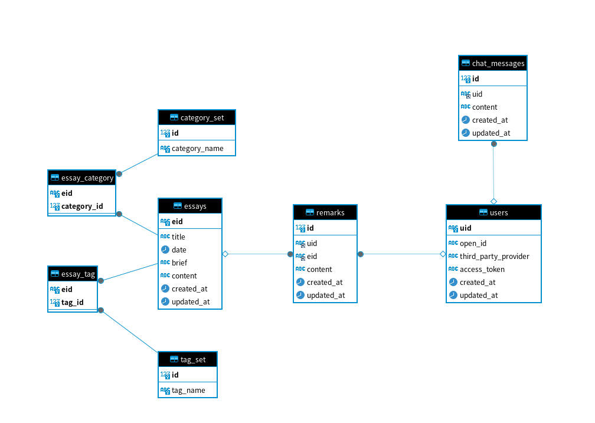

## 简介

项目名称：rusite blog
数据库名称：rusite_db
文档版本：1.0
作者信息：SolaRyan
日期：2024-4-8

## 目录

- 概述
- 数据库表结构
- 数据库操作规范
- 数据库安全和权限
- 附录

## 概述

本项目旨在开发一个在线个人博客，站主可以在上面发布文章，用户可以浏览、对某篇文章进行评论，同时有一个Online Chating Room供大家聊天。数据库是支撑整个系统的重要组成部分，用于存储文章信息、用户信息、用户评论等数据。

## 数据库表结构

1. **表：category_set**
字段：
id: 整数类型，主键，自增，不为空
category_name: 字符串类型，不为空，唯一

2. **表：chat_messages**
字段：
id: 整数类型，主键，自增，不为空
uid: UUID类型，外键，关联表 users 的 uid
content: 文本类型，可空
created_at: 时间戳类型，默认为当前时间
updated_at: 时间戳类型，默认为当前时间，更新时自动更新

3. **表：essay_category**
字段：
eid: UUID类型，主键，不为空，关联表 essays 的 eid
category_id: 整数类型，不为空，关联表 category_set 的 id，级联删除，级联更新

4. **表：essay_tag**
字段：
eid: UUID类型，主键，不为空，关联表 essays 的 eid，级联删除，级联更新
tag_id: 整数类型，不为空，关联表 tag_set 的 id，级联删除，级联更新

5. **表：essays**
字段：
eid: UUID类型，主键，不为空，默认值为 UUID
title: 字符串类型，不为空
date: 日期时间类型，可空
brief: 文本类型，不为空，默认值为 'None'
content: 长文本类型，可空
created_at: 时间戳类型，默认为当前时间
updated_at: 时间戳类型，默认为当前时间，更新时自动更新

6. **表：remarks**
字段：
id: 整数类型，主键，自增，不为空
uid: UUID类型，外键，关联表 users 的 uid，级联删除，级联更新
eid: UUID类型，外键，关联表 essays 的 eid，级联删除，级联更新
content: 文本类型，可空
created_at: 时间戳类型，默认为当前时间
updated_at: 时间戳类型，默认为当前时间，更新时自动更新

7. **表：tag_set**
字段：
id: 整数类型，主键，自增，不为空
tag_name: 字符串类型，不为空，唯一

8. **表：users**
字段：
open_id: 字符串类型，可空
third_party_provider: 字符串类型，可空，取值范围为 'github' 或 'qq'
access_token: 字符串类型，可空
created_at: 时间戳类型，默认为当前时间
updated_at: 时间戳类型，默认为当前时间，更新时自动更新
uid: UUID类型，主键，不为空，默认值为 UUID

## 数据库操作规范

1. 数据库命名规范：采用小写字母和下划线命名，如"user_info"。

2. 数据库设计原则：遵循第三范式，确保数据的一致性和规范性。

3. 数据库更新策略：使用 git 管理数据库版本，每次更新数据库都进行转储，对应一个数据库版本变更。

## 数据库安全和权限

1. 访问控制策略：采用RBAC（Role-Based Access Control）模型管理用户权限，限制用户对敏感数据的访问。

2. 数据加密：使用SSL/TLS加密数据库连接，对敏感数据进行加密存储。

## 附录

### 数据字典

**category_set**

- **描述**：存储文章分类信息的表格。
  
| 列名          | 数据类型          | 长度   | 约束         | 描述             |
|---------------|-------------------|--------|--------------|------------------|
| id            | int(10) unsigned |        | PRIMARY KEY  | 分类ID，自增     |
| category_name | varchar(255)     | 255    | UNIQUE       | 分类名称，唯一   |

---

**chat_messages**

- **描述**：存储聊天消息的表格。
  
| 列名        | 数据类型     | 长度   | 约束          | 描述                        |
|-------------|--------------|--------|---------------|-----------------------------|
| uid         | uuid         |        | FOREIGN KEY   | 用户ID，关联用户表的用户ID  |
| content     | text         |        |               | 消息内容                    |
| created_at  | timestamp    |        |               | 创建时间                    |
| updated_at  | timestamp    |        |               | 更新时间，自动更新          |
| id          | int(10) unsigned |      | PRIMARY KEY   | 消息ID，自增                |

---

**essay_category**

- **描述**：存储文章与分类关联信息的表格。
  
| 列名         | 数据类型          | 长度   | 约束             | 描述                        |
|--------------|-------------------|--------|------------------|-----------------------------|
| eid          | uuid              |        | PRIMARY KEY      | 文章ID，关联文章表的文章ID  |
| category_id  | int(10) unsigned |        | PRIMARY KEY, FOREIGN KEY | 分类ID，关联分类表的分类ID  |

---

**essay_tag**

- **描述**：存储文章与标签关联信息的表格。
  
| 列名      | 数据类型          | 长度   | 约束             | 描述                        |
|-----------|-------------------|--------|------------------|-----------------------------|
| eid       | uuid              |        | PRIMARY KEY      | 文章ID，关联文章表的文章ID  |
| tag_id    | int(10) unsigned |        | PRIMARY KEY, FOREIGN KEY | 标签ID，关联标签表的标签ID  |

---

**essays**

- **描述**：存储文章信息的表格。
  
| 列名        | 数据类型     | 长度   | 约束         | 描述                         |
|-------------|--------------|--------|--------------|------------------------------|
| eid         | uuid         |        | PRIMARY KEY  | 文章ID，唯一标识             |
| title       | varchar(255) | 255    |              | 文章标题                     |
| date        | datetime     |        |              | 文章日期                     |
| brief       | text         |        |              | 文章简介，默认为 'None'      |
| content     | longtext     |        |              | 文章内容                     |
| created_at  | timestamp    |        |              | 创建时间                     |
| updated_at  | timestamp    |        |              | 更新时间，自动更新           |

---

**remarks**

- **描述**：存储文章评论信息的表格。
  
| 列名        | 数据类型          | 长度   | 约束             | 描述                        |
|-------------|-------------------|--------|------------------|-----------------------------|
| id          | int(10) unsigned |        | PRIMARY KEY      | 评论ID，自增                |
| uid         | uuid              |        | FOREIGN KEY      | 用户ID，关联用户表的用户ID  |
| eid         | uuid              |        | FOREIGN KEY      | 文章ID，关联文章表的文章ID  |
| content     | text              |        |                  | 评论内容                    |
| created_at  | timestamp         |        |                  | 创建时间                    |
| updated_at  | timestamp         |        |                  | 更新时间，自动更新          |

---

**tag_set**

- **描述**：存储标签信息的表格。
  
| 列名      | 数据类型          | 长度   | 约束         | 描述                   |
|-----------|-------------------|--------|--------------|------------------------|
| id        | int(10) unsigned |        | PRIMARY KEY  | 标签ID，自增           |
| tag_name  | varchar(255)      | 255    | UNIQUE       | 标签名称，唯一         |

---

**users**

- **描述**：存储用户信息的表格。
  
| 列名                  | 数据类型          | 长度   | 约束             | 描述                                        |
|-----------------------|-------------------|--------|------------------|---------------------------------------------|
| open_id               | varchar(100)      |        |                  | 第三方用户的唯一标识                        |
| third_party_provider  | varchar(50)       |        | CHECK ('github', 'qq') | 第三方服务提供商（限定为'github'或'qq'）   |
| access_token          | varchar(256)      |        |                  | 访问令牌（可用于第三方登录）                |
| created_at            | timestamp         |        |                  | 创建时间                                    |
| updated_at            | timestamp         |        |                  | 更新时间，自动更新                          |
| uid                   | uuid              |        | PRIMARY KEY      | 用户ID，唯一标识                            |

### ER 图设计

### 项目所采用的其他数据库相关技术

预计数据库不会进行频繁的修改，同时数据不会非常庞大，因此考虑在后端服务启动后读取数据库中的数据到内存中，并同时维护一个消息队列，记录一段时间内的数据修改，用一个线程定期将消息队列中的内容执行，修改数据库。